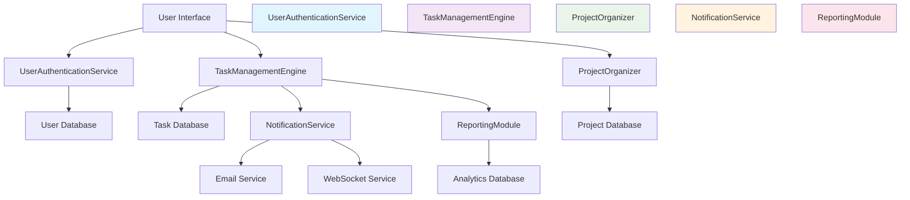

# Architectural Blueprint
## 1. Core Objective
To create a comprehensive task management system that enables users to create, assign, track, and complete tasks across multiple projects with real-time collaboration features.

## 2. System Scope and Boundaries
### In Scope
- User authentication and authorization
- Task creation, assignment, and management
- Project organization and team collaboration
- Real-time notifications and updates
- Basic reporting and analytics

### Out of Scope
- Advanced project management features (Gantt charts, critical path)
- File attachments and document management
- Integration with third-party project management tools
- Mobile application development
- Advanced workflow automation

## 3. Core System Components
| Component Name | Responsibility |
|---|---|
| **UserAuthenticationService** | Handles user registration, login, and session management |
| **TaskManagementEngine** | Core task CRUD operations and business logic |
| **ProjectOrganizer** | Manages project creation, membership, and permissions |
| **NotificationService** | Handles real-time notifications and email alerts |
| **ReportingModule** | Generates basic reports and analytics dashboards |

## 4. High-Level Data Flow

## 5. Key Integration Points
- **Authentication API**: JWT-based authentication between User Interface and UserAuthenticationService
- **Task API**: RESTful APIs between User Interface and TaskManagementEngine
- **Project API**: RESTful APIs between User Interface and ProjectOrganizer
- **Notification Gateway**: WebSocket connections for real-time updates
- **Email Service**: SMTP integration for email notifications
- **Database Connections**: PostgreSQL connections for all data storage components