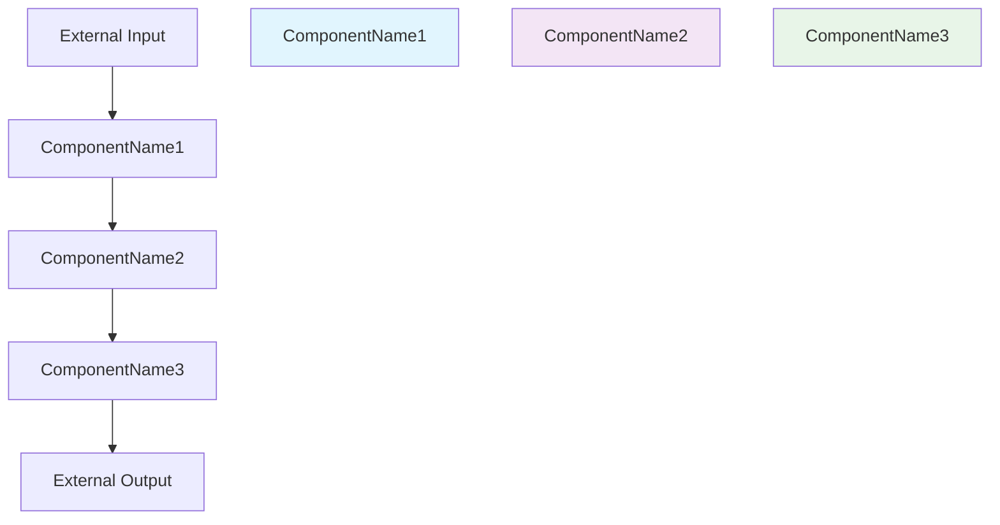

# Document Templates

This document provides detailed templates and examples for each of the five specification architect documents.

## Phase 0: Verifiable Research Template

### Strict Protocol - NO "RESEARCH SLOP"
**CRITICAL**: This phase prevents AI-generated misinformation that could lead to serious professional consequences. Every claim MUST be verified with browsed sources.

### Evidence-Based Research Template
```markdown
# Verifiable Research and Technology Proposal

## 1. Core Problem Analysis
[A brief, 1-2 sentence analysis of the user's request and the primary technical challenges.]

## 2. Verifiable Technology Recommendations
| Technology/Pattern | Rationale & Evidence |
|---|---|
| **[Technology Name]** | [Rationale derived from browsed sources, with every factual claim cited.] |
| **[Pattern Name]** | [Rationale derived from browsed sources, with every factual claim cited.] |
| **[Framework]** | [Specific capabilities and limitations supported by sources.] |
| **[Database]** | [Performance characteristics and use case suitability with citations.] |

## 3. Browsed Sources
- [1] [Complete URL of browsed source 1] - [Brief description of content]
- [2] [Complete URL of browsed source 2] - [Brief description of content]
- [3] [Complete URL of browsed source 3] - [Brief description of content]
- [...]
```

### Citation Requirements - MANDATORY

**Every factual claim MUST end with `[cite:INDEX]` citation:**

**Examples of Proper Citations:**
- ❌ "Node.js is great for real-time applications" (NO CITATION - RESEARCH SLOP)
- ✅ "Node.js excels at real-time applications due to its event-driven, non-blocking I/O model [cite:1]."
- ❌ "TypeScript reduces errors" (NO CITATION - RESEARCH SLOP)
- ✅ "TypeScript adds static typing that reduces runtime errors by approximately 15% in large codebases [cite:2]."
- ❌ "PostgreSQL is reliable" (NO CITATION - RESEARCH SLOP)
- ✅ "PostgreSQL provides ACID compliance and has been proven reliable for financial applications with 99.99% uptime [cite:3]."

### Mandatory Research Process

1. **Search THEN Browse**: Use WebSearch to find sources, then WebFetch to read the actual content
2. **NO Search Snippets**: You MUST read the full content of sources, not just search results
3. **Verify Claims**: Every technology claim must be supported by actual browsed content
4. **Cite Everything**: All factual statements must have corresponding citations
5. **Source Listing**: All browsed URLs must be listed with index numbers

### Quality Assurance Checklist

**Before proceeding to Phase 1, verify:**
- [ ] Every technology recommendation has citations
- [ ] All citations correspond to browsed sources
- [ ] No claims made without source evidence
- [ ] Source URLs are complete and accessible
- [ ] Rationales are derived from actual source content
- [ ] No "research slop" or AI-generated assumptions

**Professional Standards Compliance:**
This research process prevents the types of errors that have led to legal sanctions, financial penalties, and professional ruin when relying on unverified AI-generated content.

**Quality Gate**: Do not proceed to Phase 1 until ALL claims are cited and verified with browsed sources.

## Blueprint Template

### Complete Template
```markdown
# Architectural Blueprint
## 1. Core Objective
[Single paragraph defining the primary goal and purpose of the system.]

## 2. System Scope and Boundaries
### In Scope
- [Feature 1 that will be implemented]
- [Feature 2 that will be implemented]
- [Component 1 that will be developed]

### Out of Scope
- [Feature 1 that will NOT be implemented]
- [External system 1 that will NOT be integrated]
- [Technology 1 that will NOT be used]

## 3. Core System Components
| Component Name | Responsibility |
|---|---|
| **[ComponentName1]** | [Concise function description explaining what this component does.] |
| **[ComponentName2]** | [Concise function description explaining what this component does.] |
| **[ComponentName3]** | [Concise function description explaining what this component does.] |

## 4. High-Level Data Flow


## 5. Key Integration Points
- **API Gateway**: RESTful APIs between [ComponentName1] and [ComponentName2]
- **Database Connection**: [ComponentName2] connects to PostgreSQL database
- **External Service**: [ComponentName3] integrates with [External Service Name] via [Protocol]
- **Authentication**: JWT-based authentication between all components
```

### Blueprint Guidelines

**CRITICAL: Upfront Planning Quality Determines Everything**

- **Component Names**: Use clear, descriptive names (e.g., "UserAuthenticationService", "DataProcessingEngine")
  - Names should clearly indicate what the component DOES
  - Use consistent naming conventions (Service, Engine, Manager, Repository, etc.)
  - Avoid ambiguous names like "Helper" or "Utilities"

- **Single Responsibility Principle**: Each component should have ONE clear purpose
  - If you find yourself saying "and also", split into multiple components
  - Clear responsibilities prevent confusion and enable independent testing

- **Data Flow Visualization**: The Mermaid diagram is CRITICAL for understanding
  - Show the complete journey from external input to external output
  - Include all decision points and data transformations
  - Use colors/styles to make component boundaries obvious

- **Integration Points**: Be explicit about how components communicate
  - Specify protocols (REST, gRPC, message queues, events)
  - Define data formats (JSON, protobuf, XML)
  - Include authentication and error handling strategies

- **Boundaries Setting**: The In Scope/Out of Scope section prevents scope creep
  - Be specific about what you WILL NOT build
  - This protects against "while you're at it" additions
  - Clear boundaries enable accurate estimation and planning

## Requirements Template

### Complete Template
```markdown
# Requirements Document

## Introduction
This document defines the functional and non-functional requirements for the [System Name] system.

## Glossary
- **Term1**: Definition of term1
- **Term2**: Definition of term2
- **[ComponentName1]**: The component responsible for [function]

## Requirements

### Requirement 1: [Feature Name]
**Description**: [Brief description of what this requirement accomplishes.]

#### Acceptance Criteria
1. WHEN [trigger condition], THE **[ComponentName1]** SHALL [specific, testable behavior].
2. WHEN [another trigger condition], THE **[ComponentName2]** SHALL [specific, testable behavior].
3. GIVEN [precondition], WHEN [action], THEN **[ComponentName3]** SHALL [expected outcome].

### Requirement 2: [Another Feature Name]
**Description**: [Brief description of what this requirement accomplishes.]

#### Acceptance Criteria
1. WHEN [trigger condition], THE **[ComponentName1]** SHALL [specific, testable behavior].
2. WHEN [trigger condition], THE **[ComponentName2]** SHALL [specific, testable behavior].

## Non-Functional Requirements

### Requirement 3: Performance
**Description**: System must meet performance requirements.

#### Acceptance Criteria
1. WHEN [load condition], THE **[ComponentName1]** SHALL [response time requirement].
2. WHEN [concurrent users condition], THE **[ComponentName2]** SHALL [throughput requirement].
```

### Requirements Guidelines
- **Component References**: MUST use exact component names from blueprint (copy-paste to avoid errors)
- **Testable Criteria**: Each acceptance criterion must be measurable and testable
- **WHEN-THEN Format**: Use the format "WHEN [condition], THE **[Component]** SHALL [behavior]"
- **Requirement Numbering**: Use sequential numbering (1, 2, 3...)
- **Criteria Numbering**: Use decimal numbering (1.1, 1.2, 2.1, 2.2...)

## Design Template

### Complete Template
```markdown
# Design Document

## Overview
This document provides detailed design specifications for the [System Name] system components.

## Design Principles
- **Single Responsibility**: Each component has a single, well-defined responsibility
- **Loose Coupling**: Components interact through well-defined interfaces
- **High Cohesion**: Related functionality is grouped together
- **Scalability**: Design supports future growth and expansion

## Component Specifications

### Component: [ComponentName1]
**Purpose**: [Responsibility from blueprint - copy exactly]

**Location**: `src/components/[ComponentName1].py`

**Interface**:
```python
class [ComponentName1]:
    """
    [Brief description of component purpose]
    Implements: Req 1.1, Req 1.2
    """

    def __init__(self, dependency: [DependencyType]):
        """Initialize component with required dependencies"""
        pass

    def process_data(self, input: InputType) -> OutputType:
        """
        Process input data and return results
        Implements: Req 1.1
        """
        pass

    def validate_input(self, data: Any) -> bool:
        """
        Validate input data format and constraints
        Implements: Req 1.2
        """
        pass
```

**Dependencies**:
- [Dependency1]: [Description of dependency]
- [Dependency2]: [Description of dependency]

**Data Model**:
```python
from dataclasses import dataclass
from typing import List, Optional

@dataclass
class [DataModelName]:
    """Data structure for [ComponentName1]"""
    field1: str
    field2: int
    field3: Optional[List[str]] = None
```

### Component: [ComponentName2]
**Purpose**: [Responsibility from blueprint - copy exactly]

**Location**: `src/services/[ComponentName2].py`

**Interface**:
```python
class [ComponentName2]:
    """
    [Brief description of component purpose]
    Implements: Req 2.1, Req 2.2, Req 3.1
    """

    def __init__(self, config: ConfigType):
        """Initialize component with configuration"""
        pass

    def execute_service(self, request: RequestType) -> ResponseType:
        """
        Execute main service functionality
        Implements: Req 2.1
        """
        pass

    def handle_error(self, error: Exception) -> ErrorResponseType:
        """
        Handle and log service errors
        Implements: Req 2.2
        """
        pass
```

## Integration Design

### API Contracts
```python
# REST API between [ComponentName1] and [ComponentName2]
POST /api/process
Content-Type: application/json

Request:
{
    "data": "input_data",
    "options": {
        "validate": true,
        "format": "json"
    }
}

Response:
{
    "status": "success",
    "result": "processed_data",
    "metadata": {
        "processing_time": 150,
        "timestamp": "2024-01-01T12:00:00Z"
    }
}
```

### Database Schema
```sql
-- Table for [ComponentName2] data storage
CREATE TABLE processed_data (
    id SERIAL PRIMARY KEY,
    input_data TEXT NOT NULL,
    output_data TEXT NOT NULL,
    created_at TIMESTAMP DEFAULT CURRENT_TIMESTAMP,
    processed_by VARCHAR(100) NOT NULL
);
```
```

### Design Guidelines
- **Purpose**: Copy the responsibility exactly from the blueprint
- **Location**: Specify the exact file path where the component will be implemented
- **Requirement References**: Include "Implements: Req X.Y" comments for each method
- **Dependencies**: List all external dependencies and services
- **Data Models**: Define data structures used by the component

## Tasks Template

### Complete Template
```markdown
# Implementation Plan

## Phase 1: Core Infrastructure
- [ ] 1. Implement the [ComponentName1]
  - [ ] 1.1 Create project structure and setup
  - [ ] 1.2 Implement core [ComponentName1] class in `src/components/[ComponentName1].py`
  - [ ] 1.3 Add input validation methods
  - [ ] 1.4 Write unit tests for [ComponentName1]
  - [ ] 1.5 Create integration tests
  - _Requirements: 1.1, 1.2_

- [ ] 2. Implement the [ComponentName2]
  - [ ] 2.1 Create [ComponentName2] service class
  - [ ] 2.2 Implement main service methods
  - [ ] 2.3 Add error handling and logging
  - [ ] 2.4 Configure service dependencies
  - [ ] 2.5 Write service tests
  - _Requirements: 2.1, 2.2, 3.1_

## Phase 2: Data Layer
- [ ] 3. Implement the [ComponentName3]
  - [ ] 3.1 Setup database connection and schema
  - [ ] 3.2 Implement data access methods
  - [ ] 3.3 Add data validation and transformation
  - [ ] 3.4 Create database migration scripts
  - [ ] 3.5 Write database tests
  - _Requirements: 3.1, 3.2_

## Phase 3: Integration
- [ ] 4. API Integration
  - [ ] 4.1 Implement REST API endpoints
  - [ ] 4.2 Add request/response validation
  - [ ] 4.3 Configure API security and authentication
  - [ ] 4.4 Add API documentation
  - [ ] 4.5 Write API integration tests
  - _Requirements: 2.1, 4.1_

## Phase 4: Testing and Deployment
- [ ] 5. Testing
  - [ ] 5.1 Complete end-to-end test suite
  - [ ] 5.2 Performance testing and optimization
  - [ ] 5.3 Security testing and vulnerability scanning
  - [ ] 5.4 User acceptance testing
  - _Requirements: 3.1, 5.1_

- [ ] 6. Deployment
  - [ ] 6.1 Setup production environment
  - [ ] 6.2 Configure monitoring and logging
  - [ ] 6.3 Create deployment scripts
  - [ ] 6.4 Implement rollback procedures
  - _Requirements: 5.1, 5.2_
```

### Tasks Guidelines
- **Component Names**: Use exact component names from blueprint
- **Task Numbering**: Use sequential numbering (1, 2, 3...)
- **Sub-tasks**: Use decimal numbering (1.1, 1.2, 1.3...)
- **Requirement Tags**: Each main task must include `_Requirements: X.Y, Z.W_` tags
- **Actionable Tasks**: Each sub-task should be a specific, actionable item
- **Complete Coverage**: Every acceptance criterion from requirements must be referenced

## Validation Template

### Complete Template
```markdown
# Validation Report

## 1. Requirements to Tasks Traceability Matrix

| Requirement | Acceptance Criterion | Implementing Task(s) | Status |
|---|---|---|---|
| 1. User Authentication | 1.1 | Task 1, Task 2 | Covered |
| | 1.2 | Task 1, Task 3 | Covered |
| 2. Data Processing | 2.1 | Task 4, Task 5 | Covered |
| | 2.2 | Task 4 | Covered |
| | 2.3 | Task 6 | Covered |
| 3. Performance | 3.1 | Task 7, Task 8 | Covered |
| ... | ... | ... | ... |
| X. [Final Requirement] | X.Y | Task Z | Covered |

## 2. Coverage Analysis

### Summary
- **Total Acceptance Criteria**: [M]
- **Criteria Covered by Tasks**: [M]
- **Coverage Percentage**: 100%

### Detailed Status
- **Covered Criteria**: 1.1, 1.2, 2.1, 2.2, 2.3, 3.1, ..., X.Y
- **Missing Criteria**: None
- **Invalid References**: None

## 3. Final Validation
All [M] acceptance criteria are fully traced to implementation tasks. The plan is validated and ready for execution.
```

### Validation Guidelines
- **Matrix Generation**: Create a row for each acceptance criterion
- **Task Mapping**: List all tasks that implement each criterion
- **Status Indicators**: Use "Covered" for implemented criteria, "Missing" for gaps
- **Coverage Analysis**: Provide summary statistics and detailed status
- **Final Statement**: Confirm 100% coverage or identify gaps

## Template Usage Tips

1. **Copy-Paste Accuracy**: Copy component names exactly between documents to avoid traceability errors
2. **Sequential Numbering**: Maintain consistent numbering schemes across all documents
3. **Requirement References**: Double-check that all task requirement references exist in the requirements document
4. **Template Strictness**: Follow the templates exactly - the validation script depends on the specific format
5. **Validation First**: Run the traceability validator before considering the specification complete